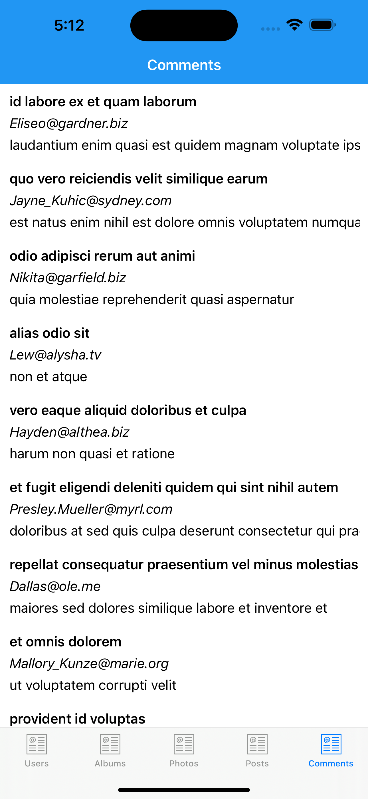
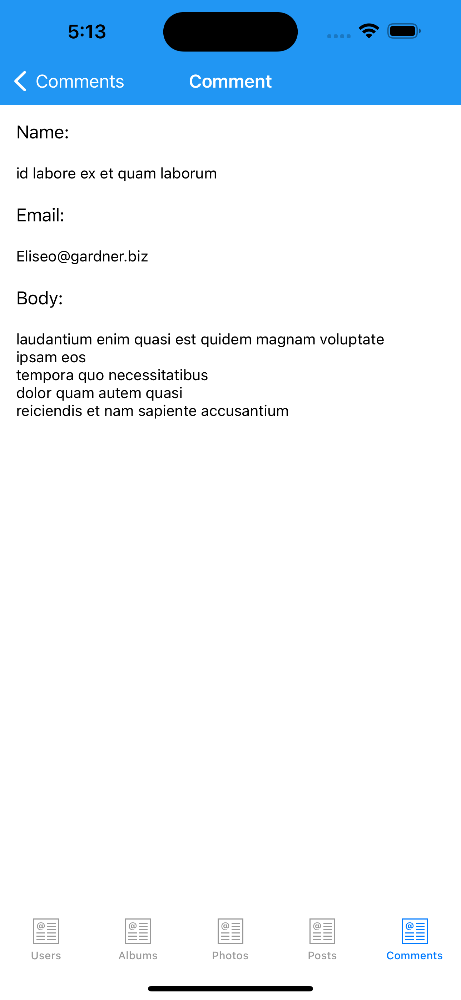
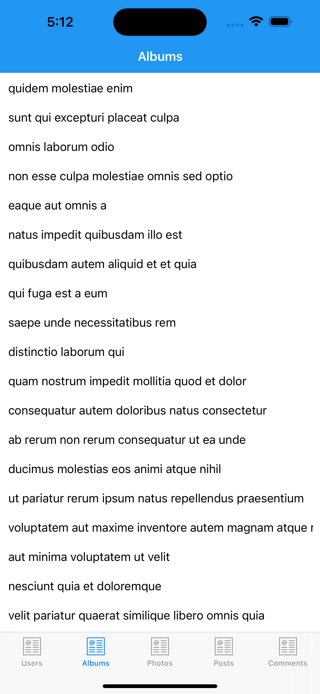
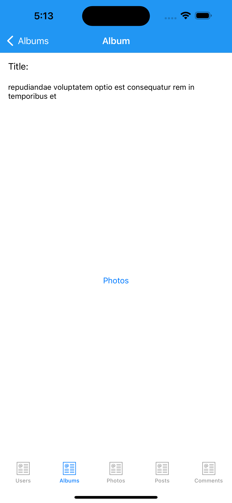
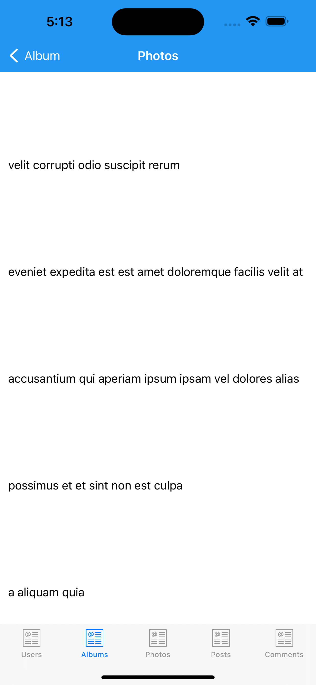
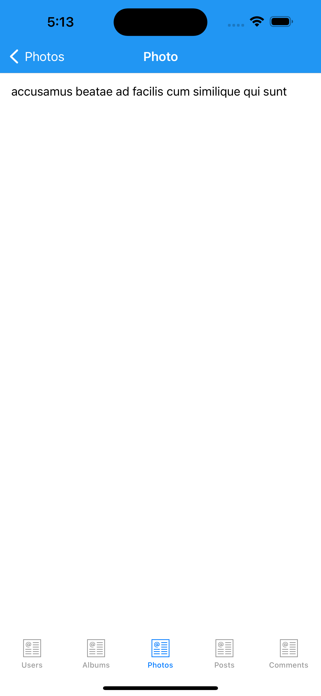
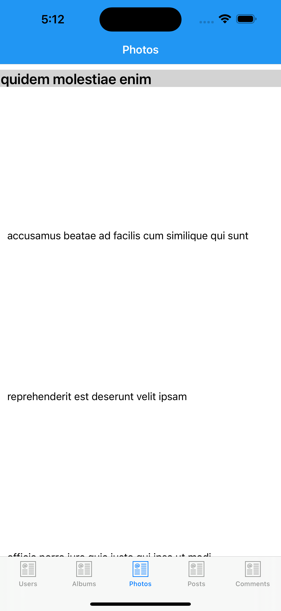
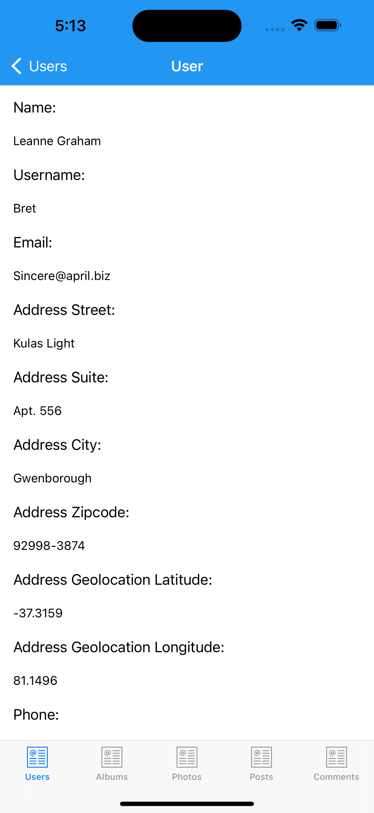

# JSONPlaceholder Xamarin.Forms

JSONPlaceholder Xamarin.Forms is a cross-platform mobile application built using Xamarin.Forms that consumes the JSONPlaceholder API. This application demonstrates how to interact with a REST API, fetch data, and display it in a structured UI.

## Features
- Display posts, comments, albums, photos, and users from JSONPlaceholder API.
- View details of each post, album, and photo.
- Navigate through different data sets seamlessly.
- Fully responsive UI for mobile devices.

## Screenshots
### Posts


### Post Details

### Post Comments


### Comments




### Albums & Photos








### Users



## Installation
1. Clone this repository:
   ```sh
   git clone https://github.com/luiseduardohd/JSONPlaceholder.git
2. Open the project in Visual Studio with Xamarin installed.
3. Restore NuGet packages.
4. Build and run the application on an emulator or a physical device.

## Technologies Used
- Xamarin.Forms
- JSONPlaceholder API
- MVVM Architecture
- .NET & C#

## Licence
All Rights reserved

## Author
Developed By Luis Eduardo HD
